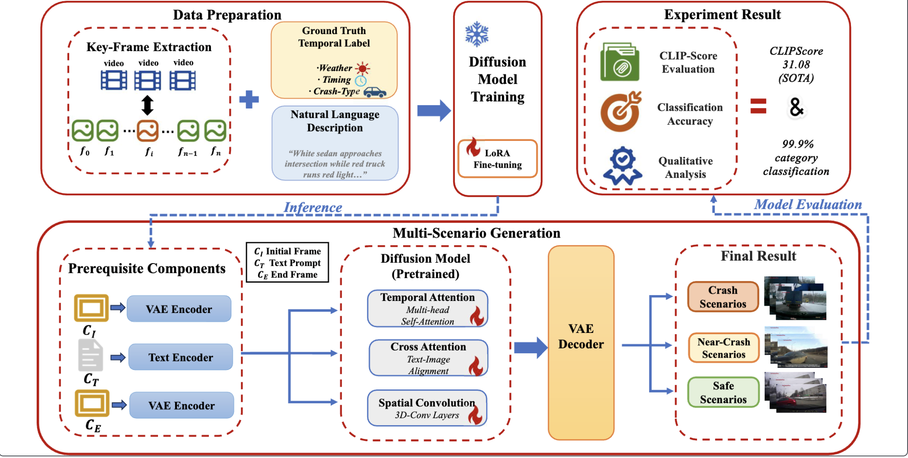

# LLM-driven Framework for Controllable Crash Scenario Generation

  

## 🔍 Overview
This repository provides the implementation of **LLM-driven Framework for Controllable Crash Scenario Generation**, designed for generating **crash, near-crash, and safe driving scenarios**.  
The framework combines **prompt engineering with LLMs**, **LoRA fine-tuned FramePack diffusion models**, and **structured evaluation methods** to enable controllable and realistic scenario synthesis for **Autonomous Driving System (ADS) testing**.

---

## 📖 Research Background
Developing reliable Automated Driving Systems (ADS) requires exposure to the **full spectrum of driving scenarios**, from safe driving conditions to rare but critical crash events. However:
- Real-world crash data is scarce and unpredictable.
- Traditional simulation lacks visual realism.
- Data-driven approaches often fail to cover the subtle distinctions between safe, near-crash, and crash cases.  

This work addresses these challenges by **controllably generating realistic scenarios** via **LLM-based prompting and video diffusion models**.

---

## ❓ Problem Statement
We aim to answer two key research questions:
1. **Can we generate diverse and realistic crash, near-crash, and safe scenarios for ADS testing?**  
2. **Can LLM prompts provide fine-grained control over scenario conditions and outcomes?**

Challenges include:
- Lack of control over scenario parameters in existing approaches.  
- Limited realism in synthetic crash/near-crash data.  
- Difficulty modeling the full safety spectrum for testing.

---

## 🚀 Contributions
- **LoRA Fine-tuned FramePack**: Enhanced for controllable crash, near-crash, and safe scenario generation.  
- **Prompt Engineering Framework**: Supports structured, natural language, and fusion prompts for environmental and behavioral control.  
- **Evaluation Pipeline**: Combines automated metrics (**Category Accuracy, CLIPScore**) with human evaluation for quality and relevance.  
- **Crash-1500 Dataset Adaptation**: Key-frame extraction and metadata for training/testing across all safety categories.

---

## 📂 Framework Overview
The pipeline consists of the following steps:
1. **Input & Preprocessing**  
   - Crash-1500 dataset  
   - Key frame extraction with metadata (timing, weather, ego-motion)

2. **Prompt Engineering**  
   - Ground-truth value prompts  
   - Description-guided prompts  
   - Fusion prompts via VLMs (Claude, Gemini, etc.)

3. **Video Generation**  
   - Frozen diffusion model (FramePack)  
   - LoRA adaptation for controllable generation  

4. **Scenario Outputs**  
   - Crash scenarios (high-risk events)  
   - Near-crash scenarios (critical situations)  
   - Safe scenarios (normal driving)  

---

## 📊 Data Preparation
- **Key-Frame Extraction**: Critical moments of crash/near-crash events  
- **Video Description Generation**: Automatic textual descriptions from frames  

---

## 🔧 Training (LoRA Fine-tuning)
We adopt **Low-Rank Adaptation (LoRA)** for efficient fine-tuning:
- Preserves pre-trained FramePack generalization  
- Injects control layers for near-crash scenario generation  
- Curriculum learning: gradually increases conditioning complexity  
